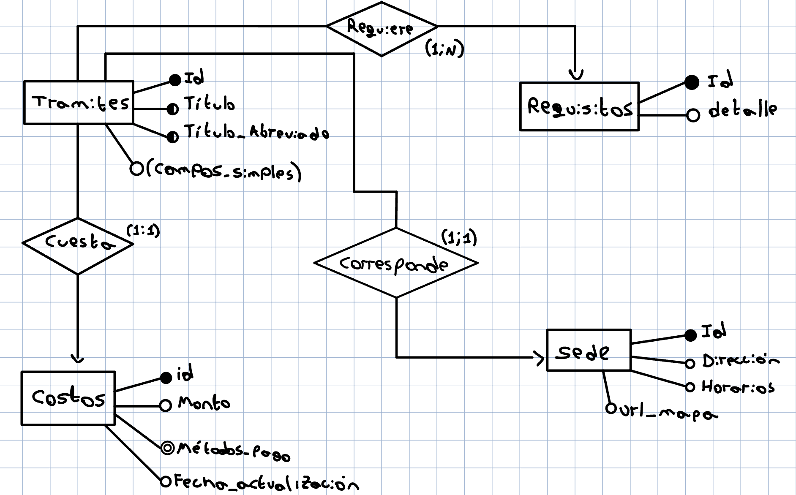

# San Luis Tramites Backend Entidad-Relacion

## Entidades: 
* Tramites
* Requisitos
* Costos
* Sede

## Especificación de Entidades

### Tramites (Trámites)
Tramites = {id, titulo, titulo_abreviado, description, fecha_ultima_actualizacion, definicion, destinatarios, consejo_local, fuentes_informacion}
* id: Integer (identificador único del trámite)
<!-- * slug: String (identificador corto y único, ej. "cipe") -->
* titulo: String (título completo del trámite, ej. "CIPE (DNI Provincial)")
* titulo_abreviado: String (título abreviado, ej. "CIPE")
* description: String (descripción detallada del trámite)
* fecha_ultima_actualizacion: String (fecha de última actualización, ej. "Enero 2026")
* definicion: String (explicación de qué es el trámite)
* destinatarios: String (descripción de para quién está destinado el trámite)
* consejo_puntano: String (consejo local o truco específico)
* fuentes_informacion: String (fuentes de información)

### Requisitos
Requisitos = {id, detalle}
* id: Integer (identificador único del requisito)
* detalle: String (descripción del requisito, ej. "DNI original (argentino, en vigencia)")

### Costos
Costos = {id, monto, metodos_pago, fecha_actualizacion}
* id: Integer (identificador único del costo)
* monto: String (monto del costo, ej. "Consultar valor actualizado...")
* metodos_pago: Array<String> (lista de formas de pago, ej. ["Efectivo", "Transferencia bancaria", "Pago electronico"])
* fecha_actualizacion: String (fecha de actualización del costo, ej. "Enero 2026")

### Sede
Sede = {id, direccion, horarios, url_mapa}
* id: Integer (identificador único de la sede)
* direccion: String (dirección de la sede, ej. "Centro de Tramites, Terrazas del Portezuelo...")
* horarios: String (horarios de atención, ej. "Lunes a viernes de 8:00 a 14:00 hs")
* url_mapa: String (URL de Google Maps, ej. "https://maps.google.com/?q=Terrazas+del+Portezuelo+San+Luis")

## Relaciones
* Tramites - Requisitos: Un trámite puede tener múltiples requisitos (1:N)
* Tramites - Costos: Un trámite tiene un costo asociado (1:1)
* Tramites - Sede: Un trámite se realiza en una sede (1:1)

Nota: Para los enlaces oficiales (enlacesOficiales), se podría considerar una entidad adicional "EnlacesOficiales" si se expande en el futuro, pero por ahora se puede manejar como un campo adicional en Tramites si es necesario.

## Diagrama

